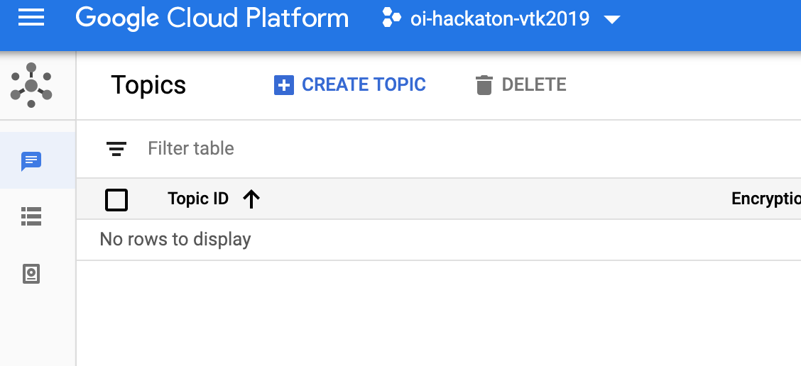
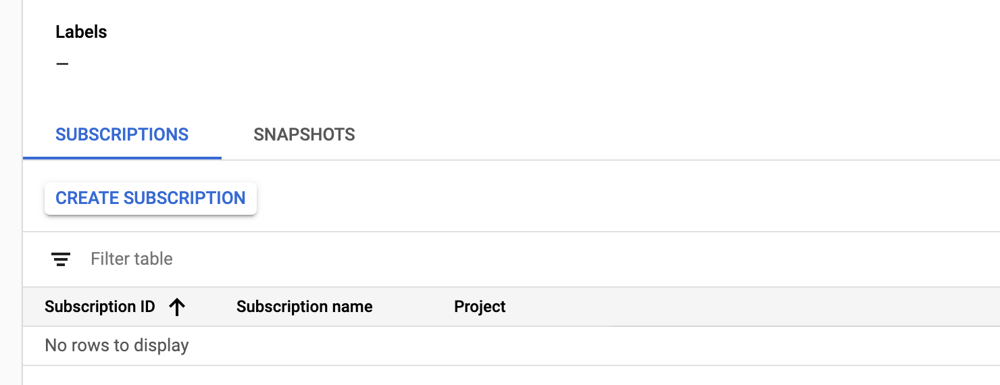
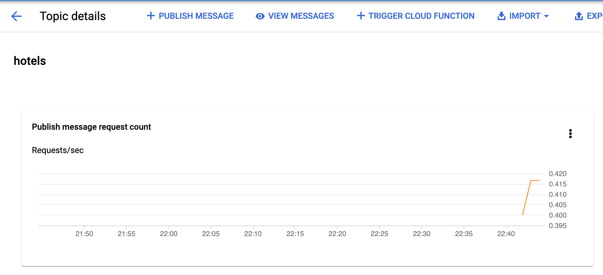
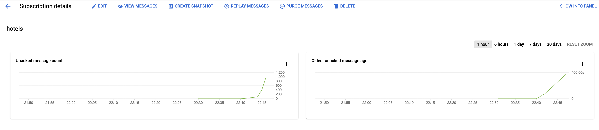
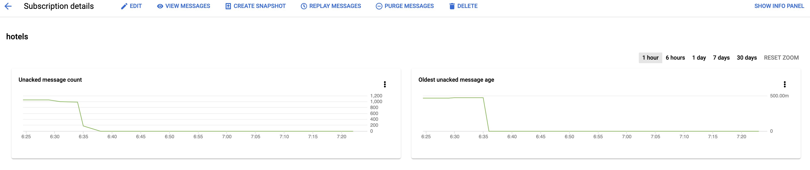
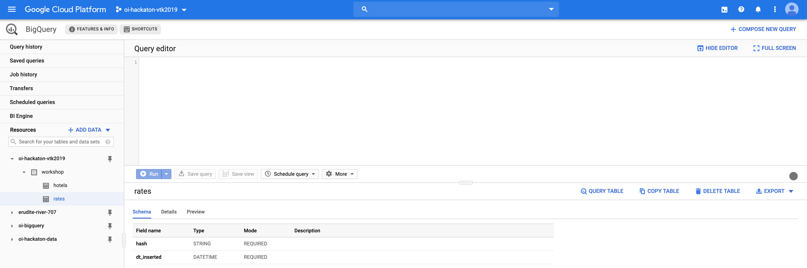
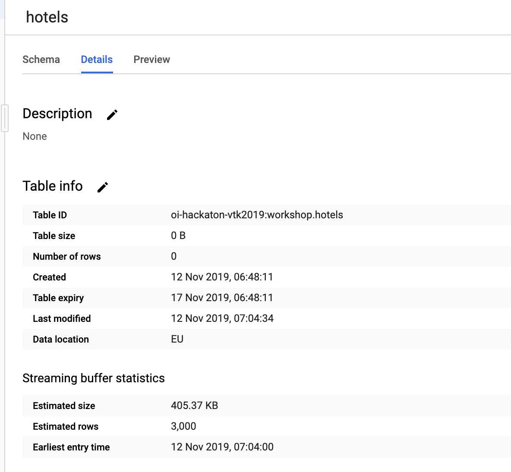
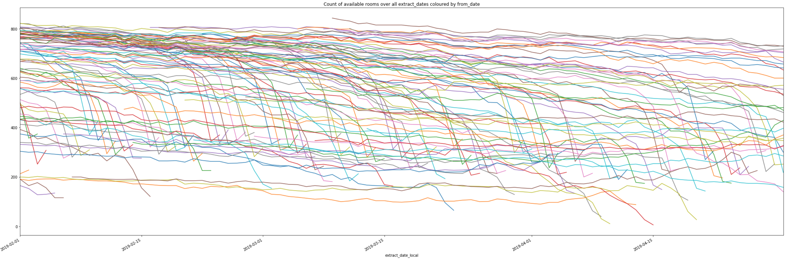
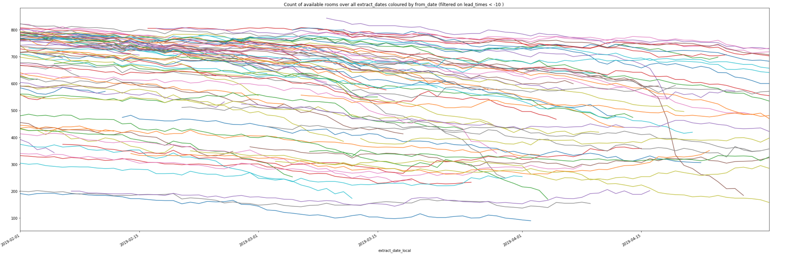

# 0. Gcloud SDK setup

In order to work with Google Cloud services, you'll need to install the Gcloud SDK and have a Google (@gmail.com) account.

- Follow the instructions on the Gcloud SDK installation docs: https://cloud.google.com/sdk/docs/downloads-interactive.
- If you don't have a Gmail account, create one and log in with it.
- In a terminal window, type `gcloud auth login`. This will open a browser window where you can select your Gmail account. There will be a message in the terminal saying you are now authenticated.

If you run into issues, we'll have a look at the start of the event itself. We'll provide a solution so you can work on a remote VM as well in case it really does not work locally.

Next to that you'll need to have a Python environment, and ideally you already look to install the Scrapy package: http://doc.scrapy.org/en/latest/intro/install.html#installation-guide

If you have set this up, call us and we will grant each member of your group access to your groups' gcloud project, and give you the address of the server you'll work with.

If you run into issues with software setup, give us a call and we'll have a look at the start of the event.

# 1. Introduction

The goal of the workshop is to extract data from a website, push that data onto a queueing system to process and clean it, store it in a large-scale database, and then run some analysis on the extracted dataset.

You're going to scrape the information of a website with rates of hotel rooms. Your server is located on [http://35.195.124.189:31123/](http://35.195.124.189:31123/) and represents a very basic OTA (Online Travel Agency, e.g. [Booking.com](https://www.booking.com), [Expedia](https://www.expedia.com/), [Hotels.com](https://nl.hotels.com/) ...) website containing a selected limited dataset of real rates we have taken: they come from [Booking.com](https://www.booking.com) and span about a year in the future. The data can be divided into a subset of hotel room rates from Brussels, Amsterdam, Paris and London, extracted earlier this month. Accross the site, there are some anti-bot measure being put in place which you'll have to counter. When you have extracted all the data and loaded them into a database, you'll have to answer some questions about it. The anti-bot measures are different per destination (so hotels in Amsterdam are differently behaving from hotels in London), so you can always start with the easiest destination and already look at the analytics query to calculate whatever you need. Later you can add the data about the new destinations.

If you have any questions about what to do, need help, or have any other question, be sure to ask us. We're present with some people to help you out. If you are stuck anywhere along one of the tasks for a while, call us to help you.

# 2. Tasks to do

Note: we recommend with 2 people starting on the scraping part (2.a.1 and 2.a.2), 1 person working on the transformation part (2.b), and 1 person starting on the data-analysis for the pre-filled dataset (3.b). As soon as you get some data from the webscraping, you can start on (3.a) where you are being asked questions about that data.

## 2.a. Website scraping

This part contains the steps to implement the website crawler. which will visit all pages of the website and extract some raw data from it. We'll implement it in Python using the framework [Scrapy](https://scrapy.org/). This is the most well-known and widely used scraping framework, which we ourselves run as well on a very large scale.

*Note*: Each group has its own webserver. It should be capable of handing the load you will generate during the workshop without much issue. Should it be misbehaving or stop working, let us know so we can have a look.

Start by looking around a bit on the site. It's a very simple website with regards to its structure and functionality. You can search for a room using the form on the homepage, which will give you a list of matching hotels, and if you click through on each, it will show you the information of the rate. For simplicity here, every combination of a hotel, arrival date and departure date only has 1 rate (or no rate of course if it doesn't offer anything for a certain period). On real websites, you'll nearly allways get multiple rates with different characteristics; different types of beds, seaside views, with or without breakfast included, some you can cancel without paying and some you cannot ... These determine the price you pay. On your target website, we have selected just one of them.


#### Setup

In order to start, you can checkout the skeleton repository on [Github: blank scraping repo](blank_scraping_repo). This contains a Scrapy project with the blanks in the code for you to fill in. In order to run it, you'll need to have Python installed. Make a virtual environment for this project and install the requirements for it:

```bash
mkvirtualenv workshop-scrapy
pip install -r requirements.txt
```

*Note: it is possible that Scrapy does not install on your machine. If you encounter issues, have a look on the [Scrapy installation instructions](http://doc.scrapy.org/en/latest/intro/install.html#platform-specific-installation-notes) if one of the solutions there solves your problem. If you are unable to install it, we can setup a VM for you to work on. Ideally you can work locally though, as debugging and viewing your code is a lot easier that way. However we don't want you to get stuck on just the installation phase.*

##### Work with remote VM

Each project has a remote machine to work with if locally your setup gives issues. Log in via SSH like this

```bash
gcloud beta compute --project <your-project-name> ssh --zone "europe-west1-c" "scrapy-vm-1"
```

To copy files to the remote machine, do e.g.
```bash
gcloud compute scp --project <your-project-name> --zone "europe-west1-c" --recurse /Users/mhindery/repositories/otainsight/hackathon-scrapy/ scrapy-vm:~/
```

### 2.a.1 Get all the available hotels and their properties present on the site

Note: This following description follows the scrapy tutorial on the [Scrapy Docs](https://docs.scrapy.org/en/latest/intro/tutorial.html#scrapy-tutorial), so make sure to have a look there as well.

First you need to gather information about the inventory on the site: Which hotels are offering rates there? Every hotel on the site has some information about it on the site which you'll also need to store for analysis later on (e.g. the number of stars rating it has). Look where you can find this information on the site and how it is structured. In the same way you visit the site in your browser, your scraper will have to follow links to get to all pages it needs (but while you can just have a look, visually understand stuff and click around, your spider can only follow the rigid url structure you'll define in the code).

In the file `workshop/spiders/ota_hotels.py` there is a spider class `OtaHotelsSpider` where you need to implement this spider. It has two placeholder methods you'll need to fill in. To run this spider as it is, which will do a request to google and output a dummy dictionary, do:

```bash
cd workshop
scrapy crawl hotels
```

It will output some configuration info, then the list of every url it visits, the items resulting from `parse_function`, periodically some stats about its progress and at the end some stats about all the requests it did:

```
2019-11-08 11:51:31 [scrapy.utils.log] INFO: Scrapy 1.7.3 started (bot: workshop)
2019-11-08 11:51:31 [scrapy.utils.log] INFO: Versions: lxml 4.4.1.0, libxml2 2.9.9, cssselect 1.1.0, parsel 1.5.2, w3lib 1.21.0, Twisted 19.7.0, Python 3.7.4 (default, Sep  7 2019, 18:27:02) - [Clang 10.0.1 (clang-1001.0.46.4)], pyOpenSSL 19.0.0 (OpenSSL 1.1.1c  28 May 2019), cryptography 2.7, Platform Darwin-18.7.0-x86_64-i386-64bit
...
... some config info ...
...
2019-11-08 11:51:31 [scrapy.core.engine] INFO: Spider opened
2019-11-08 11:51:31 [scrapy.extensions.logstats] INFO: Crawled 0 pages (at 0 pages/min), scraped 0 items (at 0 items/min)
...
... urls it is visiting ...
...
2019-11-08 11:51:31 [scrapy.core.engine] DEBUG: Crawled (200) <GET https://www.google.com/> (referer: None)
2019-11-08 11:51:32 [scrapy.core.scraper] DEBUG: Scraped from <200 https://www.google.com/>
...
... items we got from the dummy implementation: ...
...
{'Success': True}
2019-11-08 11:51:32 [scrapy.core.engine] INFO: Closing spider (finished)
...
... some stats when it finishes ...
...
2019-11-08 11:51:32 [scrapy.statscollectors] INFO: Dumping Scrapy stats:
{'downloader/request_bytes': 213,
 'downloader/request_count': 1,
 'downloader/request_method_count/GET': 1,
 'downloader/response_bytes': 6180,
 'downloader/response_count': 1,
 'downloader/response_status_count/200': 1,
 'elapsed_time_seconds': 0.318787,
 'finish_reason': 'finished',
 'finish_time': datetime.datetime(2019, 11, 8, 10, 51, 32, 76671),
 'item_scraped_count': 1,
 'log_count/DEBUG': 2,
 'log_count/INFO': 10,
 'memusage/max': 53223424,
 'memusage/startup': 53219328,
 'response_received_count': 1,
 'scheduler/dequeued': 1,
 'scheduler/dequeued/memory': 1,
 'scheduler/enqueued': 1,
 'scheduler/enqueued/memory': 1,
 'start_time': datetime.datetime(2019, 11, 8, 10, 51, 31, 757884)}
2019-11-08 11:51:32 [scrapy.core.engine] INFO: Spider closed (finished)
```

There are 2 methods you need to implement: `start_requests` and `parse_function`. The `start_requests` function is the entry point of your scraper: here you generate a set of urls to start visiting, and for each url, the callback function that will be called with the result. In that callback function (in this case `parse_function`, you can have multiple ones and name them however you like), you extract the information from the response and yield it as a dictionary.

Look in the [Scrapy tutorial part about data extracting](https://docs.scrapy.org/en/latest/intro/tutorial.html#extracting-data) for how to get the elements you need. Start with a basic implementation in your parsing method and make sure you can reach all the hotels before getting lost in extracting the info from each hotel; due to some anti-bot measures, you won't be able to get everything at first. **Start with the hotels from Amsterdam.** Once Amsterdam works, see the part 2.a.3 for adding data for others.


To investigate how to extract the necessary elements from the website responses, start by yielding (one or) some hardcoded urls in `start_requests`. The Scrapy docs then mention the [Scrapy shell](https://docs.scrapy.org/en/latest/topics/shell.html#topics-shell) which you can use to interactively inspect a response. You can also use [Ipdb](https://pypi.org/project/ipdb/), which opens an interactive ipython shell where you want to debug something; add this line as the first one in your function.

```python
def parse_function(self, response):
    import ipdb; ipdb.set_trace()
    # rest of your functions' code
```

Now run the crawler, and it will allow you to debug your coded by stepping through it. Useful basic commands are
- `n`: *next*; execute the line which the arrow is pointing at and go forward.
- `c`: *continue*; let your program run along (until the end or until you set a new breakpoint)
- `pp <item>`: pretty-print an object.

It looks like this:


You can try some data extracting here interactively using the `response` object. Your parsing function needs to yield a dictionary, with all of the information in it. Store as much information about the hotel as possible; it's easier to later correct mistakes when you have raw data.

Run your crawler and look at the logs, they will contain the items you generate. Compare the info against what you see yourself on the site.

Once you (think you) have the spider done (**to reiterate, focus on Amsterdam only for the time being**) and it's yielding dicts for each hotels, you can run it with a flag to store every item being yielded in a json file locally (which you'll read in a next stage). In this case the results are small enough to save on disk on a file, in real life scenario's (and at our scale) this if of course not the case, but it'll work well here and is easy to work with and inspect. Run it with the output flag like this:

```bash
scrapy crawl ota_hotels -o hotels.json
```

Note that successive runs will append to this file and not overwrite is, so it's best to remove or rename it after you made changes to your crawler.

#### Scale it up

Once you can succesfully crawl hotels and their info, you'll want to speed it up, and do some more requests concurrenctly. Otherwise you won't be able to get all the data in time. Have a look at `workshop/workshop/settings.py` to tweak some of the settings to increase the throughput.

Once you've increased the throughput, do some different runs and compare the output results. Depending on which destinations you are crawling, you might see different results (the ordering of items is irrelevent, compare the content, e.g. number of hotels you get each time ...). The differences will occur in destinations different from Amsterdam. If you look at the logs from your run, and the output statistics at the end, you might see what is causing this. Have a look around (in the Scrapy docs, Google around) what you are experiencing here and how you can handle this issue with Scrapy... As a hint, this will only occur if you have increased the throughput sufficiently.

Issue: Add middleware to handle 429 rate limiting

### 2.a.2 Get the rates of all hotels on the site for the coming year.

Now that you have (some of) the hotels in the inventory of the site, you can start getting the rates for them. The file `workshop/spiders/ota_rates.py` will the spider for the rates. Implement it in the same way as you have done the previous spider. Look around on the website for how the url's are structured so you can generate them in `start_requests`. Going via the search form every time and looping through the results would be very inneficient (in reality not feasible). The hotels available on the website are available in the json you made in the previous step, so use that to generate requests.

Our dataset contains rates with number of persons in a room being 1 or 2, arrival dates ranging from `2019-11-06` to `2020-11-30`, and number of nights for a stay ranging from 1 up until (and including) 3. Make a `start_requests` method to loop over all destinations, all hotels in each destination, and all the date ranges.

Extract the properties of each rate and yield a dictionary from your parse function. For the time being, also use the `-o rates.json` flag to store the results in a json file. You can inspect the results easily this way, and in the next step you'll push them to a queue as you do when scaling up to handle larger amounts of data.

*Note: we advise to store as much raw information as possible in the item you are yielding. The goal of the scraper is to just collect web pages, extract parts of it and then push them to a later component. That later component (the transform step) will then process the item and this is where you'll do things like string parsing of raw information in your item. This allows you to do a bugfix in your transformation step if you encounter e.g. a new type of breakfast-included message and reprocess all the items on the queue with the latest transformation code to correct things in your database, without having to recrawl.*

Note that you likely won't be able to access all rates with your first attempt. This is intentional :) **Focus on the rates in Amsterdam first to get your crawler going.** Once Amsterdam works, see the part 2.a.3 for adding data for others.

### 2.a.3 Add other data than Amsterdam.

For different locations, the website will behave a bit different. Amsterdam is the easiest one. When you get that going, you can start looking into adding data from other locations.

#### Add data for Paris

At this point, try looking at the hotels and rates in Paris.
The rates (and hotels) for Paris are likely not going to work; you'll get a 403 response when scraping. This might or might not be the case as well when you visit the page in your browser(s) (which is also the hint about what is causing this). Find out why that is, and implement a change to counter this blocking. Compare what your browser is sending vs what Scrapy is sending as a request.

Issue: It's user-agent blocking

#### Add data for London

Add the hotels and rates from London. Something is wrong on these rates, they'll likely not be parsed by your current implementation. Find out why your scraper is not working and fix it. You might have to look for alternatives here :)

TODO: how to suggest they need to be looking at Beautiful soup without making it too obvious?

Issue: Broken html, use Beautiful Soup

#### Add data for Brussels

Add the hotels from Brussels. You should get an error when scraping rates there. Look again at what is different between the request from scrapy vs the request from your browser. Note that the same protection as in Paris is in place for Brussels as well. If you get a 403 response, it's because that issue; this issue will be a 400 response.

Issue: requires cookie with base64-encoded path in it

### 2.a.4 Push to distributed queues

Once you start working with more data, you can't keep working with dumping to files locally. You'll likely distribute crawlers over multiple machines, scale them up and down on demand, and have them generate different kind (of subsets) of data. In this step you'll start pushing items to a queueing system. At the other end of the queueing there will be code to handle each item, in our case simply writing them to a database. You could also use this component (which we call the 'transform' step) to write each item to multiple destinations, do some statistics counting, raise alerting when some kind of items are being seen, sample items to write to a staging system or backup location ... Separating the functionality allows to scale both components independantly, write each one in the language of framework which suits its best, develop separate components faster versus having one giant piece of code which does 'everything'...

In this workshop our queueing system is [PubSub](https://cloud.google.com/pubsub/) and the database is [BigQuery](https://cloud.google.com/bigquery/). Both are managed, highly scalable cloud offerings so you don't need to handle infrastructure management yourself.

#### Push items to pubsub from the crawler

##### Setup the PubSub items in the cloud console.

Create a topic and a subscription for both hotels and for rates. Do this in the [Cloud console](https://console.cloud.google.com), look for the `PubSub` part in the listview under the hamburger menu. Click on `Create topic` to make topics:



For each topic, click on it (in the column `Topic ID`, or it will open up this page after creation automatically), to add subscriptions using the `Create subscription` button:



Fill in the name of the subscription (which you can choose yourself), tick the box at the bottom saying `Retain acknowledged messages`, and leave the rest as defaults.

**Note: as you will likely scrape destination per destination separately, and you might encounter issues with destinations which you don't have with others, it is advised to separate them in pubsub and bigquery. You can make one topic called 'rates' and make separate subscriptions for each destination. That way, if you have fixed a bug in your data transformation and parsing, related to a certain destination, you can reprocess all the messages for a certain destination by replaying all the messages from one subscription.**

##### Use the queues in Scrapy

In order to send each item to pubsub, you have to write a `Pipeline` class which processes items. All items which are yielded by your parsing functions are sent through the Scrapy [Item Pipeline](https://docs.scrapy.org/en/latest/topics/item-pipeline.html) in order to be processed sequentially by all the pipelines defined in it. Have a look at the documentation for some examples what you can do with it and how to make one and enable it.

In `workshop/pipelines.py` there is already such a pipeline defined, where each item can be processed. It should start with sending each item (being a python dict) to a function (which will later post it to the pubsub queue, for now just e.g. print something). Based on the `spider.name` attribute you can differentiate between the hotels spider and the rates spider; they should both send to a different topic of course.

If you raise a `DropItem` exception from your pipeline, the item will no longer be processed further; if you don't, you can just add something here and it will still e.g. output the item to the command-line log or to json.

The actual sending function is quite easy to write: have a look at the [PubSub docs](https://cloud.google.com/pubsub/docs/) which has quickstarts and guides for every language. Items on pubsub are plain bytes, so your function will take the item which was yielde by your function, optionally you can add fields to it (e.g. a timestamp can be handy), encode into bytes, and then publish that on the topic.

If you run your scraper now, you'll see pubsub-related message appearing in the logs. If you go in the cloud console to one of your subscriptions, you'll see with a slight delay that messages are being pushed to the topic:



If you click on `View Messages` on top, you can inspect messages on the topic in your browser.

If you go to the corresponding subscription in the cloud console, you'll see the number of non-processed messages, and the age of the oldest message increasing as well:



From the cloud console, you can manually push and pull message from topics and subscriptions.

## 2.b Transformation step

#### Pull items in python script ...

*Note: If you didn't get the crawler to push to pubsub yet, you can make a simple python script to generate dummy messages (but with the right structure), and push these to your pubsub topic. That way you can do this part simultaneously.*

Now on the other side of the queue you need something to receive items from pubsub, and stream every item into BigQuery.

Look at the pubsub docs [PubSub docs](https://cloud.google.com/pubsub/docs/) for how to receive items. Write your code in a file in the `transform` folder of this repo; this already contains some boilerplate to get started with the bigquery part. It's easiest if you make a separate file for hotels and rates.

Start first with just receiving items from the pubsub queue, printing them, and acknowledging them. If you don't acknowledge a message, the queue will eventually resend it to a receiver of the queue (which might be you, but might be someone else if you have multiple machines receiving from the queue), so every item you sucessfully process should be ack-ed. If you don't, the system will automatically slow down with sending you messages and eventually block, since you will have a ton of messages in memory which aren't being acked, and the system sees that as being a bad receiver. During development, you can thus also choose to not ack a message, and you'll receive it over and over again, which can be useful. Follow up in the cloud console on the receive operations and ack-operations from your subscription. You'll see that the number of unacknowledged messages (and the age) will go down:



When you are succesfully receiving messages, you can start adding the write into bigquery.

#### ... and stream them into BigQuery

When you can receive items from pubsub, you need to persist them into a database (i.e. BigQuery). Have a look at the [BigQuery docs](https://cloud.google.com/bigquery/streaming-data-into-bigquery) on how to do streaming inserts in python. Have a look at `transform/hotels.py` for some skeleton code to work with bigquery. It will take a dataset (which you can compare to a traditional database), and get_or_create a table for either hotels. Expand the schema with the fields you need. Make a similar file for the rates table.

*Note on the rates table schema: since you will likely iterate during development, you can end up with multiple entries in the table for a certain rate. Add a `rate_hash` field to your schema, which is the combination of `hotel_id`, `arrival_date`, `departure_date`, and `number_persons`, as that combination represents a single rate from the site. This way you can easily select the latest version of each rate later on, and correct mistakes in your crawler without having to recrawl everything.*

If you execute the script, it will print out `Table hotels created`. Go the cloud console and search for BigQuery. You'll see the tables have been created:



You can view their schema here, stats about how much data they contain (none at this point of course), preview the content, export the data ... If you click on `Query Table`, the textbox above will fill with a SQL statement to query the table you've selected. If you make mistakes on your schema, or have garbage in there, you can just delete a table and start over.

Now make a function which will take an item and write it to BigQuery. Look in the BigQuery docs on how to do Streaming data inserts. Your pubsub receive function / callback will thus have to write every item it receives to the table.

Once you start inserting data, go to the BigQuery cloud console and look up your table. In the `Preview` tab, you'll be able to see and verify the data you're inserting. In the `Details` tab you'll see under `Streaming buffer statistics` that new data is being inserted into the table. Data will first be inserted in this buffer, and an estimate is made of the size and rowcount. After a while the data will be under `Table info` with an exact size and row count. For the purpose of this workshop, this difference does not matter.



You can start querying your data now and verifying if all looks good.

Note: you'll likely have inserted data (both hotels or rates) which later might get corrected if you update your crawler. In that case need to deduplicate your rows so you only end up with 1 version of each hotel / rate. The [BigQuery docs](https://cloud.google.com/bigquery/streaming-data-into-bigquery#manually_removing_duplicates) describe how you can do deduplication. While testing and developing, it's also handy to create tables with suffix `_1`, `_2` ... which you can easily throw away after you fill them potentially with garbage. This helps keeping your final table clean.

## 3 Analysis questions

### 3.a BigQuery analysis on scraped data

These are questions about the data you gathered. Each of them asks the question 'per destination', so you can start looking for the solution as soon as you have some data from the easiest destinations. All of these questions can be found by querying the dataset from BigQuery.

#### Hotels

- How many hotels, and how many rooms do we have in each destination.

```sql
SELECT destination, COUNT(DISTINCT hotel_id) AS num_hotels, SUM(room_count) AS num_rooms FROM `oi-bigquery.test.mathieu_workshop_hotels_1` GROUP BY destination
```

```json
[
  {
    "destination": "Amsterdam",
    "num_hotels": "1625",
    "num_rooms": "39519"
  },
  {
    "destination": "Paris",
    "num_hotels": "5003",
    "num_rooms": "108834"
  },
  {
    "destination": "London",
    "num_hotels": "3873",
    "num_rooms": "134502"
  },
  {
    "destination": "Brussels",
    "num_hotels": "748",
    "num_rooms": "20981"
  }
]
```

- For each destination, which hotels are the furthest apart? Use the normal euclidian $L^2$ norm as distance metric
  
  *You'll notice that this will require a cross join to calculate the distance from each hotel to the others in a destination. This isn't where BigQuery is very performant, so you'll need to add some filters to reduce the volume of this join. E.g. do this query destination by destination instead of all at once with a group by at the end.*

    Solution: Per destination, do

    ```sql
    WITH distances AS (
        SELECT
        e.destination,
        e.hotel_id as e_hotel_id,
        e.hotel_name as e_hotel_name,
        l.hotel_id as l_hotel_id,
        l.hotel_name as l_hotel_name,
        e.latitude as e_latitude,
        l.latitude as l_latitude,
        e.latitude-l.latitude latdiff,
        l.longitude as l_longitude,
        e.longitude as e_longitude,
        e.longitude-l.longitude longdiff,
        sqrt(((abs(e.longitude-l.longitude)) * (abs(e.longitude-l.longitude))) + ((abs(e.latitude-l.latitude)) * (abs(e.latitude-l.latitude)))) as distance
        FROM
        `oi-hackaton-vtk2019.workshop.hotels` e
        JOIN
        `oi-hackaton-vtk2019.workshop.hotels` l
        ON 
        # Filtering
        e.destination = "Amsterdam" AND l.destination = "Amsterdam" AND NOT (e.hotel_id = l.hotel_id)
    )

    SELECT * FROM distances order by distance desc LIMIT 20
    ```

    Results:

    - Amsterdam: 1568015 / B&B The Red House -> 543781 / De Greenhouse = 0.24829683571055355
    - Paris: 1738888 / YOTELAIR Paris CDG - Transit Hotel -> 1929890 / Chic Boulogne Apartment = 0.383157345979431
    - Brussels: 726272 / Auberge des 3 Fontaines -> 1747138 / Villa les bisous = 0.2247488180660683
    - London: 1263969 / The Beaumont -> 2654957 / Luxury Apartments in Westminster = 119.9861090522311

#### Rates

- For these hotels, how many rates are there in the dataset, how many are refundable / nonrefundable and how many include breakfast / no breakfast?
    - Hotel Asterisk 3 star superior
    - Hôtel Belvue
    - Best Western Hôtel Folkestone Opéra
    - Hotel De Hallen
    - Hôtel Da Vinci & Spa
    - Heston Hyde Hotel
    - The Concert Hotel
    - New Linden Hotel
    - The Toren
    - Bedford Hotel & Congress Centre
    - Escale Hotel
    - Ideal Hotel
    - Hotel des Galeries
    - Ham Yard Hotel  Firmdale Hotels
    - St Paul\'s Hotel
    - Hotel Dupond-Smith
  
    Solution:
    
    ```sql
    WITH rates_per_hotel AS (
        SELECT hotel_id,
        COUNT(*) as num_rates,
        SUM(IF(refundable, 1, 0)) as refundables,
        SUM(IF(refundable, 0, 1)) as nonrefundables,
        SUM(IF(breakfast_included, 1, 0)) as breakfast,
        SUM(IF(breakfast_included, 0, 1)) as nonbreakfast
        FROM `oi-hackaton-vtk2019.workshop.rates`
        WHERE hotel_id IN (10003, 10004, 1004657, 293614, 1027860, 1041733, 1000151, 1013770, 1002044, 1013657, 102343, 1006522, 1071176, 1328347, 1461970, 20069)
        GROUP BY hotel_id
    )

    SELECT h.destination, h.hotel_name, h.hotel_id, r.num_rates, r.refundables, r.nonrefundables, r.breakfast, r.nonbreakfast FROM rates_per_hotel r INNER JOIN `oi-hackaton-vtk2019.workshop.hotels` h ON r.hotel_id = h.hotel_id
    ORDER BY h.destination, h.hotel_name
    ```

    Results:

    ```json
    [
        {
            "destination": "Amsterdam",
            "hotel_name": "Hotel Asterisk 3 star superior",
            "hotel_id": "10003",
            "num_rates": "265",
            "refundables": "0",
            "nonrefundables": "265",
            "breakfast": "0",
            "nonbreakfast": "265"
        },
        {
            "destination": "Amsterdam",
            "hotel_name": "Hotel De Hallen",
            "hotel_id": "1004657",
            "num_rates": "148",
            "refundables": "0",
            "nonrefundables": "148",
            "breakfast": "0",
            "nonbreakfast": "148"
        },
        {
            "destination": "Amsterdam",
            "hotel_name": "The Concert Hotel",
            "hotel_id": "293614",
            "num_rates": "200",
            "refundables": "0",
            "nonrefundables": "200",
            "breakfast": "0",
            "nonbreakfast": "200"
        },
        {
            "destination": "Amsterdam",
            "hotel_name": "The Toren",
            "hotel_id": "10004",
            "num_rates": "240",
            "refundables": "0",
            "nonrefundables": "240",
            "breakfast": "2",
            "nonbreakfast": "238"
        },
        {
            "destination": "Brussels",
            "hotel_name": "Bedford Hotel & Congress Centre",
            "hotel_id": "20069",
            "num_rates": "341",
            "refundables": "206",
            "nonrefundables": "135",
            "breakfast": "209",
            "nonbreakfast": "132"
        },
        {
            "destination": "Brussels",
            "hotel_name": "Escale Hotel",
            "hotel_id": "1461970",
            "num_rates": "44",
            "refundables": "0",
            "nonrefundables": "44",
            "breakfast": "0",
            "nonbreakfast": "44"
        },
        {
            "destination": "Brussels",
            "hotel_name": "Hotel des Galeries",
            "hotel_id": "1071176",
            "num_rates": "52",
            "refundables": "3",
            "nonrefundables": "49",
            "breakfast": "0",
            "nonbreakfast": "52"
        },
        {
            "destination": "Brussels",
            "hotel_name": "Hôtel Belvue",
            "hotel_id": "1328347",
            "num_rates": "87",
            "refundables": "87",
            "nonrefundables": "0",
            "breakfast": "0",
            "nonbreakfast": "87"
        },
        {
            "destination": "London",
            "hotel_name": "Ham Yard Hotel  Firmdale Hotels",
            "hotel_id": "1002044",
            "num_rates": "278",
            "refundables": "278",
            "nonrefundables": "0",
            "breakfast": "278",
            "nonbreakfast": "0"
        },
        {
            "destination": "London",
            "hotel_name": "Heston Hyde Hotel",
            "hotel_id": "1013657",
            "num_rates": "359",
            "refundables": "1",
            "nonrefundables": "358",
            "breakfast": "0",
            "nonbreakfast": "359"
        },
        {
            "destination": "London",
            "hotel_name": "New Linden Hotel",
            "hotel_id": "102343",
            "num_rates": "83",
            "refundables": "0",
            "nonrefundables": "83",
            "breakfast": "83",
            "nonbreakfast": "0"
        },
        {
            "destination": "London",
            "hotel_name": "St Paul\\'s Hotel",
            "hotel_id": "1006522",
            "num_rates": "359",
            "refundables": "4",
            "nonrefundables": "355",
            "breakfast": "0",
            "nonbreakfast": "359"
        },
        {
            "destination": "Paris",
            "hotel_name": "Best Western Hôtel Folkestone Opéra",
            "hotel_id": "1013770",
            "num_rates": "118",
            "refundables": "2",
            "nonrefundables": "116",
            "breakfast": "0",
            "nonbreakfast": "118"
        },
        {
            "destination": "Paris",
            "hotel_name": "Hotel Dupond-Smith",
            "hotel_id": "1027860",
            "num_rates": "89",
            "refundables": "0",
            "nonrefundables": "89",
            "breakfast": "9",
            "nonbreakfast": "80"
        },
        {
            "destination": "Paris",
            "hotel_name": "Hôtel Da Vinci & Spa",
            "hotel_id": "1041733",
            "num_rates": "88",
            "refundables": "0",
            "nonrefundables": "88",
            "breakfast": "0",
            "nonbreakfast": "88"
        },
        {
            "destination": "Paris",
            "hotel_name": "Ideal Hotel",
            "hotel_id": "1000151",
            "num_rates": "84",
            "refundables": "0",
            "nonrefundables": "84",
            "breakfast": "0",
            "nonbreakfast": "84"
        }
        ]
    ```

- Give the percentage of hotels per destination which were sold out on 25-12-2019

    ```sql
    WITH rates AS (
    SELECT * FROM `oi-bigquery.test.mathieu_workshop_rates_1` WHERE arrival_date = '2019-12-25'
    )

    SELECT h1.destination, COUNT(DISTINCT r1.hotel_id) AS amount_hotels_with_rates, COUNT(DISTINCT h1.hotel_id) AS amount_hotels from `oi-bigquery.test.mathieu_workshop_hotels_1` h1 LEFT JOIN rates r1 ON h1.hotel_id = r1.hotel_id GROUP BY h1.destination
    ```

    Results

    ```json
    [
    {
        "destination": "Amsterdam",
        "amount_hotels_with_rates": "309",
        "amount_hotels": "1625"
    },
    {
        "destination": "Paris",
        "amount_hotels_with_rates": "1107",
        "amount_hotels": "5003"
    },
    {
        "destination": "London",
        "amount_hotels_with_rates": "677",
        "amount_hotels": "3873"
    },
    {
        "destination": "Brussels",
        "amount_hotels_with_rates": "141",
        "amount_hotels": "748"
    }
    ]
    ```

    - Amsterdam: 309 / 1625 = 0,1901538462 => 19% availability
    - Paris: 1107 / 5003 = 0,2212672397 => 22% availability
    - London: 677 / 3873 = 0,1747998967 => 17.5% availability
    - Brussels: 141 / 748 = 0,1885026738 => 19% availability

- What's the average price per person, destination, and number of stars. Do this in two steps:
  - Calculate for every rate the per-person-per-night cost, and take for each hotel the cheapest of the available options per  arrivel date. For example, if you arrive at a certain date, there could be a room for 2 persons for a stay of 3 nights available, and there could be a room for 1 person for 2 nights available. In order to allow some form of comparions, equalize each rate to this per-person-per-night cost. Note that this calculation, and looking at the cheapest option, assumes that you would be able to pick and match rates; take 2 nights from the first option from the example, and then 1 night from the second option. In reality this is not the case, but otherwise a comparison would be infeasible here.
  
    You can save this intermediate calculation as a table in BigQuery to use in the next step.

    ```sql
    WITH rates_per_night_per_person AS (
    SELECT hotel_id, amount, number_guests, arrival_date, departure_date, DATE_DIFF(departure_date, arrival_date, DAY) as nights, ( amount / number_guests / DATE_DIFF(departure_date, arrival_date, DAY) ) AS pppn FROM `oi-bigquery.test.mathieu_workshop_rates_1`
    )

    SELECT DISTINCT hotel_id, arrival_date, first_value(pppn) over(partition by hotel_id, arrival_date order by pppn asc) as cheapest_pppn FROM rates_per_night_per_person r1 ORDER BY hotel_id, arrival_date 
    ```

    => Saved as BQ table mathieu_workshop_intermediate_1

  - Take the average of these calculates prices per hotel, and then group / average per destination and number of stars. Note that for some hotels we don't have the number of stars as information. Skip these for this analysis.

    ```sql
    WITH avg_rates_per_night_per_person AS (
    SELECT hotel_id, AVG(cheapest_pppn) as avg_pppn FROM `oi-bigquery.test.mathieu_workshop_intermediate_1` GROUP BY hotel_id
    )

    SELECT destination, stars, ROUND(AVG(avg_pppn)) as avg_pppn_final FROM `oi-bigquery.test.mathieu_workshop_hotels_1` h1 INNER JOIN avg_rates_per_night_per_person r1 ON h1.hotel_id = r1.hotel_id WHERE stars != 0 GROUP BY destination, stars ORDER BY destination, stars
    ```

    Result:

    ```json
    [
    {
        "destination": "Amsterdam",
        "stars": "1",
        "avg_pppn_final": "48.0"
    },
    {
        "destination": "Amsterdam",
        "stars": "2",
        "avg_pppn_final": "52.0"
    },
    {
        "destination": "Amsterdam",
        "stars": "3",
        "avg_pppn_final": "64.0"
    },
    {
        "destination": "Amsterdam",
        "stars": "4",
        "avg_pppn_final": "90.0"
    },
    {
        "destination": "Amsterdam",
        "stars": "5",
        "avg_pppn_final": "187.0"
    },
    {
        "destination": "Brussels",
        "stars": "1",
        "avg_pppn_final": "38.0"
    },
    {
        "destination": "Brussels",
        "stars": "2",
        "avg_pppn_final": "43.0"
    },
    {
        "destination": "Brussels",
        "stars": "3",
        "avg_pppn_final": "50.0"
    },
    {
        "destination": "Brussels",
        "stars": "4",
        "avg_pppn_final": "68.0"
    },
    {
        "destination": "Brussels",
        "stars": "5",
        "avg_pppn_final": "89.0"
    },
    {
        "destination": "London",
        "stars": "1",
        "avg_pppn_final": "65.0"
    },
    {
        "destination": "London",
        "stars": "2",
        "avg_pppn_final": "50.0"
    },
    {
        "destination": "London",
        "stars": "3",
        "avg_pppn_final": "56.0"
    },
    {
        "destination": "London",
        "stars": "4",
        "avg_pppn_final": "92.0"
    },
    {
        "destination": "London",
        "stars": "5",
        "avg_pppn_final": "178.0"
    },
    {
        "destination": "Paris",
        "stars": "1",
        "avg_pppn_final": "24.0"
    },
    {
        "destination": "Paris",
        "stars": "2",
        "avg_pppn_final": "55.0"
    },
    {
        "destination": "Paris",
        "stars": "3",
        "avg_pppn_final": "71.0"
    },
    {
        "destination": "Paris",
        "stars": "4",
        "avg_pppn_final": "105.0"
    },
    {
        "destination": "Paris",
        "stars": "5",
        "avg_pppn_final": "234.0"
    }
    ]
    ```

- For stays of 1 night, calculate the average price for a room for each hotel if you arrive on a weekday versus if you arrive on a weekend day. How any hotels are more expensive in the weekend than during the week? Why is that do you think?

    ```sql
    WITH los1_avg_rates_partitioned AS (
    SELECT hotel_id,
    AVG(IF(CAST(FORMAT_DATE("%u", arrival_date) AS INT64) <= 5, amount, null)) as avg_amount_week,
    AVG(IF(CAST(FORMAT_DATE("%u", arrival_date) AS INT64) > 5, amount, null)) as avg_amount_weekend
    FROM `oi-bigquery.test.mathieu_workshop_rates_1` WHERE DATE_DIFF(departure_date, arrival_date, DAY) = 1
    GROUP BY hotel_id
    )

    SELECT * FROM los1_avg_rates_partitioned
    ```

    ```sql
    SELECT destination, COUNT(DISTINCT h1.hotel_id) AS weekend_more_expensive FROM `oi-bigquery.test.mathieu_workshop_hotels_1` h1 INNER JOIN los1_avg_rates_partitioned r1 ON h1.hotel_id = r1.hotel_id WHERE avg_amount_weekend > avg_amount_week GROUP BY destination ORDER BY destination
    ```

    Result:

    ```json
    [
    {
        "destination": "Amsterdam",
        "weekend_more_expensive": "186"
    },
    {
        "destination": "Brussels",
        "weekend_more_expensive": "9"
    },
    {
        "destination": "London",
        "weekend_more_expensive": "264"
    },
    {
        "destination": "Paris",
        "weekend_more_expensive": "86"
    }
    ]
    ```

    Explanation as to why this is? Not something which is necessarily present in the data, just think about it.
    
    Leisure hotels vs business hotels have different pricing strategies.

## 3.b. Analysis on pre-filled dataset

This part of the analysis can be done separately from all the rest. It works on a dataset we have already loaded into BigQuery for you. The analysis itself should be done using the [Pandas](https://pandas.pydata.org/) library, which is one of the most well-known data analysis packages in use. You can run a notebook locally or work on [Google Colab](https://colab.research.google.com/) which offers hosted notebooks.

### Dataset info

In your BigQuery tables, you can find the table `hackathon_vtk_amsterdam_rates`. This is a dataset containing hotel rates from Amsterdam with arrival dates ranging from `2019-02-01` to `2019-05-31`, and extract date ranging from `2019-02-01` to `2019-04-30`. This means it contains for a certain arrival date several versions of a rate, scraped on different dates. So, assuming a fixed arrival date of e.g. `2019-03-17`, the dataset contains the price which was advertised (and which we scraped) on `2019-02-01`, on `2019-02-02`, on `2019-02-03`, ... until `2019-03-16`. The difference between the arrival date and the extract date is called the `lead time`. Specifically, he dataset contains lead times starting from *80* days before a certain arrival date up until the day before the arrival date. This dimensions allows to investigate the behaviour or prices when you come closer to the actual date of your stay.

Apart from the date characteristics, these are rates with some fixed dimensions; they are all for a stay of 1 night, for a room which suits 2 people, the rates are refundable without cost, ... to allow fair comparison. These fixed dimensions are not present in the table as columns, as they are not necessary for the task at hand. The schema does contain the price amount, the arrival and extract dates, the room name of the rate, and the hotel id. There are about 3.3 million rows in the table. Every row represents an available room for an extract date.

You'll also find the table `hackathon_vtk_amsterdam_events`. This contains a set of events happening in Amsterdam between `2019-02-01` and `2019-06-01`, so they could have an impact on the rates being contained in the rates table.

### Analysis with Pandas

The analysis should be performed in a Python Notebook using Pandas.

Go to the [Google Colab](https://colab.research.google.com/) and Upload `data/solution.ipynb` in there to fire up a notebook. Alternatively, you can run this notebook locally if you happen to have the necessary software installed. Follow the instructions in the notebook from there.

Some charts referenced in the notebook:

Count of available rooms over all extract_dates coloured by from_date:



Filtered version without lead times < 10


